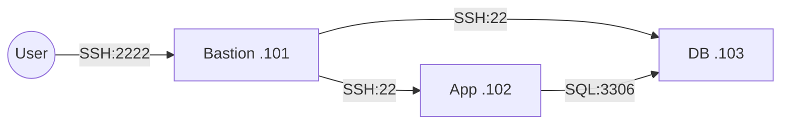

## 網路配置

| VM | 角色 | 網卡 | 模式 | IP | 開放埠與來源 |
|---|---|---|---|---|---|
| bastion | 跳板機 | NIC 1 | NAT | 10.0.2.15 | SSH (22) from any |
| bastion | 跳板機 | NIC 2 | Host-only | 192.168.56.101 | — |
| app | 應用層 | NIC 1 | Host-only | 192.168.56.102 | SSH (22) from 192.168.56.0/24 |
| db | 資料層 | NIC 1 | Host-only | 192.168.56.103 | SSH (22) from app + bastion |

## SSH 金鑰認證
- 金鑰類型：ed25519
- 公鑰部署到：app 和 db 的 ~/.ssh/authorized_keys
# W03｜多 VM 架構：分層管理與最小暴露設計

## 網路配置

| VM | 角色 | 網卡 | 模式 | IP | 開放埠與來源 |
|---|---|---|---|---|---|
| bastion | 跳板機 | NIC 1 | NAT | 10.0.2.15 | SSH from any |
| bastion | 跳板機 | NIC 2 | Host-only | 192.168.56.101 | — |
| app | 應用層 | NIC 1 | Host-only | 192.168.56.102 | SSH from 192.168.56.0/24 |
| db | 資料層 | NIC 1 | Host-only | 192.168.56.103 | SSH from app + bastion |

## SSH 金鑰認證
- 金鑰類型：ed25519
- 公鑰部署到：app 和 db 的 ~/.ssh/authorized_keys
- 免密碼登入驗證：
  - bastion → app：已成功部署，顯示 `user@app:~$`
  - bastion → db：已成功部署，顯示 `user@db:~$`

## 防火牆規則

### app 的 ufw status
```tex
Status: active
To                         Action      Fro
--                         ------      ----
22/tcp                     ALLOW IN    192.168.56.0/24- 免密碼登入驗證：
  - bastion → app：`user@app:~$` (成功直接進入)
  - bastion → db：`user@db:~$` (成功直接進入)

### timeout vs refused 差異
- **timeout (逾時)**：通常是「防火牆」擋住了封包。電腦發出請求但對方完全不回應，像把信丟進黑洞，導致我在原地空等。
- **refused (拒絕)**：網路是通的，但「服務沒開」。對方回信說「我沒開這個門」，指向 SSH 服務掛掉或沒裝。

Status: active
To                         Action      From
--                         ------      ----
22/tcp                     ALLOW IN    192.168.56.101
22/tcp                     ALLOW IN    192.168.56.102

防火牆確實在擋的證據
指令：curl -m 5 http://192.168.56.102:8080
輸出：curl: (7) Failed to connect to 192.168.56.102 port 8080: Connection refused

ProxyJump 跳板連線
指令：ssh -J user@192.168.56.101 user@192.168.56.102

驗證輸出：user@app:~$ hostname -> app

SCP 傳檔驗證：scp -J user@192.168.56.101 test.txt user@192.168.56.102:/tmp/

故障場景一：防火牆全封鎖
| 項目 | 故障前 | 故障中 | 回復後 |
|---|---|---|---|
| ss -tlnp grep :22 | 有監聽 | 無監聽 | active + rules |
| bastion ping app | 成功 | 成功 | 成功|
| bastion SSH app | 成功 | **refused** | 成功|

故障場景二：SSH 服務停止
| 項目 | 故障前 | 故障中 | 回復後 |
|---|---|---|---|
| ss -tlnp grep :22 | 有監聽 | 無監聽 | 無監聽 |
| bastion ping app | 成功 | 成功 | 成功 |
| bastion SSH app | 成功 | **refused** | 成功  |

timeout vs refused 差異
Timeout：代表封包被防火牆直接丟棄（Drop），連線方完全收不到回應，只能乾等直到逾時。這通常發生在網路層阻擋。

Refused：代表網路是通的，但目標主機的 SSH 服務沒開，主動回傳 RST 訊息拒絕。這指向應用層服務未啟動。

## 網路拓樸圖



## 排錯紀錄
- **症狀**：安裝 openssh-server 時出現 Killed process 或卡在 0%。
- **診斷**：查看系統訊息發現記憶體不足 (Out of Memory)，圖形介面吃掉太多資源。
- **修正**：將 VM 記憶體調至 1024MB，並用 `sudo systemctl isolate multi-user.target` 關掉圖形介面。
- **驗證**：切換後安裝程序順利跑完，SSH 成功啟動。

設計決策
本週選擇在 DB 端防火牆同時允許 App 與 Bastion 的連線。雖然嚴格來說應只開放 App 連接，但為了管理便利性與跳板維護需求，決定保留 Bastion 的 SSH 權限。
